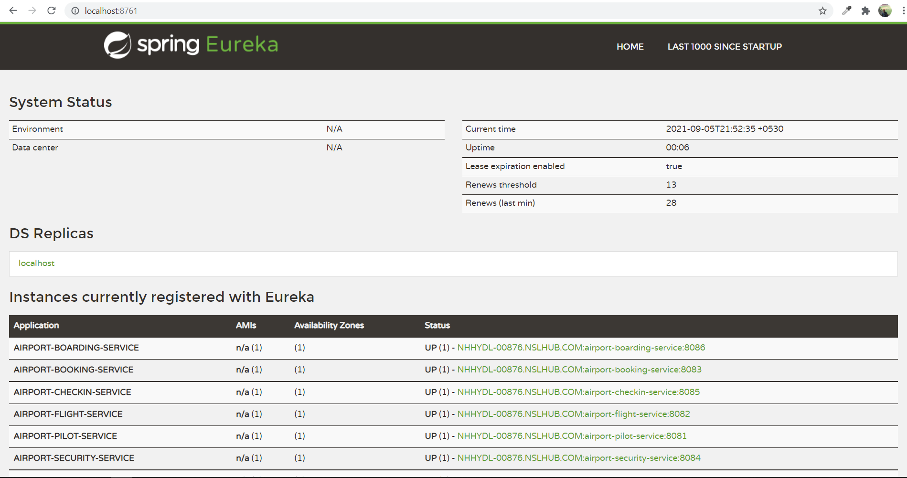

## A comprehensive example on microservices using spring-boot with spring-cloud

It is a project for airport service. 

In this project we have created six microservices for airport officials and airport passengers. These microservices provides services from passenger's ticket booking to passenger's boarding.

It has two more microservices one for eureka server and one for api gateway.

 

|Microservice|Purpose|Note|     
|----|-----|-----|     
|**airport-pilot-service**|<li>It is a microservice for airport officials</li><li>It is having APIs for PILOT such as createPilot, getPilotById, getAllPilots, updatePilot, deletePilot, findPilotsByDesignation & flushCache</li>|
|**airport-flight-service**|<li>It is a microservice for airport officials</li><li>It is having APIs for FLIGHT such as createFlight, getFlightById, updateFlight, deleteFlight & searchFlightBySourceDestinationAndDate|This microservice internally calls airport-pilot-service using OpenFiegn to get PILOT details.</li>|
|**airport-booking-service**|<li>It is a microservice for airport flight passengers & airport officials</li><li>It is having APIs for BOOKING such as createBooking, getBookingById & findBookingByPNRNumber|This microservice internally calls airport-flight-service using OpenFiegn to get FLIGHT details.</li>|
|**airport-security-service**|<li>It is a microservice for airport officials</li><li>It is having APIs for airport SECURITY check such as createSecurity, getSecurityById & findSecurityByBookingId</li>|
|**airport-checkin-service**|<li>It is a microservice for airport officials</li><li>It is having APIs for airport CHECKIN service such as createCheckin, getCheckinById & findCheckinByBookingId</li>|
|**airport-boarding-service**|<li>It is a microservice for airport officials</li><li>It is having APIs for BOARDING findBoardingByBookingId|This microservice internally calls airport-booking-service, airport-checkin-service, airport-security-service using OpenFiegn to get BOOKING, CHECKIN, SECURITY CHECK details.</li>|
|**eureka-server**|It is a microservice for service discovery and registry|
|**api-gateway**|It is a microservice work as a gateway (single entry point) for all microservices|

## Microservice Architecture

## Technology Stack
* **Spring Boot** (Starter)
	* **Web**
		* RESTful API [controller](./airport-pilot-service/src/main/java/com/airport/pilot/controller/PilotController.java), [service](./airport-pilot-service/src/main/java/com/airport/pilot/service/PilotServiceImpl.java), [repository](./airport-pilot-service/src/main/java/com/airport/pilot/repository/PilotRepository.java), [entity](./airport-pilot-service/src/main/java/com/airport/pilot/entity/PilotEntity.java), [VO](./airport-pilot-service/src/main/java/com/airport/pilot/request/Pilot.java), [DTO](./airport-pilot-service/src/main/java/com/airport/pilot/response/PilotResponse.java), [yml](./airport-pilot-service/src/main/resources/application.yml), [pom](./airport-pilot-service/pom.xml)
		* @ControllerAdvice [exception handling](https://github.com/SirajChaudhary/comprehensive-example-on-microservices-using-spring-boot-with-spring-cloud/wiki/ControllerAdvice-Annotation)
		* SLF4J with Logback [logging](https://github.com/SirajChaudhary/comprehensive-example-on-microservices-using-spring-boot-with-spring-cloud/wiki/SLF4J-with-Logback)
	* **Test**
		* JUnit
			* [unit testing](./airport-pilot-service/src/test/java/com/airport/pilot/controller/PilotControllerTest.java) for RestController
		* Jacoco [code coverage](https://github.com/SirajChaudhary/comprehensive-example-on-microservices-using-spring-boot-with-spring-cloud/wiki/Jacoco)
	* **Data JPA**
	* **Actuator** [monitor & manage microservices](https://github.com/SirajChaudhary/comprehensive-example-on-microservices-using-spring-boot-with-spring-cloud/wiki/Actuator)
		* CORS enabled [allow specific cross origin, methods](./airport-pilot-service/src/main/resources/application.yml)
		* **Prometheus & Grafana** [monitoring & alerting systems](https://github.com/SirajChaudhary/comprehensive-example-on-microservices-using-spring-boot-with-spring-cloud/wiki/Prometheus-&-Grafana)
	* **Mail** [send an email](https://github.com/SirajChaudhary/comprehensive-example-on-microservices-using-spring-boot-with-spring-cloud/wiki/Mail)
* **Spring Cloud** (Starter)
	* **Eureka Server & Clients** [service discovery server and clients](https://github.com/SirajChaudhary/comprehensive-example-on-microservices-using-spring-boot-with-spring-cloud/wiki/Spring-Cloud-Eureka)
	* **Gateway** [api gateway](https://github.com/SirajChaudhary/comprehensive-example-on-microservices-using-spring-boot-with-spring-cloud/wiki/Spring-Cloud-Gateway)
		* `Zuul is deprecated.` 
		* It also does load balancing so no need to use separate Spring Cloud Load Balancer. `Ribbon is deprecated.`
	* **OpenFeign** [declarative REST client](https://github.com/SirajChaudhary/comprehensive-example-on-microservices-using-spring-boot-with-spring-cloud/wiki/Spring-Cloud-OpenFeign)
		* Its an alternative to WebClient. `RestTemplate is deprecated.`
	* **Circuit Breaker** 
		* It provides an abstraction across different circuit breaker implementations i.e. Resilience4J, Spring Retry. `Hystrix is deprecated`
		* **Resilience4j** [circuit breaker implementation](https://github.com/SirajChaudhary/comprehensive-example-on-microservices-using-spring-boot-with-spring-cloud/wiki/Spring-Cloud-Circuit-Breaker)
	* **Sleuth & Zipkin** [distributed tracing system](https://github.com/SirajChaudhary/comprehensive-example-on-microservices-using-spring-boot-with-spring-cloud/wiki/Spring-Cloud-Sleuth-&-Zipkin)
* **Hazelcast** [caching](https://github.com/SirajChaudhary/comprehensive-example-on-microservices-using-spring-boot-with-spring-cloud/wiki/Hazelcast)
* **SonarQube** [code quality review](https://github.com/SirajChaudhary/comprehensive-example-on-microservices-using-spring-boot-with-spring-cloud/wiki/SonarQube)
* **OpenAPI** [swagger-ui](https://github.com/SirajChaudhary/comprehensive-example-on-microservices-using-spring-boot-with-spring-cloud/wiki/Swagger-UI)
* **Postman** 
* **Lombok** [minimize the boilerplate code](https://github.com/SirajChaudhary/comprehensive-example-on-microservices-using-spring-boot-with-spring-cloud/wiki/Lombok)
* **ModelMapper** [object mapping](https://github.com/SirajChaudhary/comprehensive-example-on-microservices-using-spring-boot-with-spring-cloud/wiki/ModelMapper)
* **Maven**
* **JDK 11**
* **Eclipse IDE**
	* **ANSIConsole plugin** [colorful console logs](https://github.com/SirajChaudhary/comprehensive-example-on-microservices-using-spring-boot-with-spring-cloud/wiki/ANSI-Console)
* **MySQL RDBMS**
* **Docker** [dockerization](https://github.com/SirajChaudhary/comprehensive-example-on-microservices-using-spring-boot-with-spring-cloud/wiki/Docker)

## HowTo
**Step 1.** Database Setup (you can use MySQL Workbench)
* create schema `CREATE DATABASE airportdb`
* create tables by running dump file [airportdb.sql](https://github.com/SirajChaudhary/comprehensive-example-on-microservices-using-spring-boot-with-spring-cloud/blob/master/airportdb.sql) 

**Step 2 (optional).** Download and [Run the Zipkin Server](./snapshots/start-zipkin-server.PNG) to [trace Sleuth logs](./snapshots/run-zipkin-server-and-trace-any-sleuth-request.PNG) on GUI.

**Step 3.** [Configure lombok](https://github.com/SirajChaudhary/comprehensive-example-on-microservices-using-spring-boot-with-spring-cloud/wiki/Lombok) for your eclipse IDE (i.e. run lombok.jar)

**Step 4.** Clone the project
> git clone https://github.com/SirajChaudhary/comprehensive-example-on-microservices-using-spring-boot-with-spring-cloud.git

**Step 5.** Import the project into your eclipse IDE

**Step 6.** Update following properties
* update your database credentials in the .properties file wherever it is used in all microservices.
* update YOUR_GMAIL_USERNAME/YOUR_GMAIL_PASSWORD in the [.properties file](./airport-bookings-service/src/main/resources/application.yml) of airport-booking-service.  

**Step 7.** Build all microservices `mvn clean install`
 - we build microservices in the following sequence and before that we set Java Build Path of each microservice to JDK11
* eureka-server
* api-gateway
* airport-pilot-service
* airport-flight-service
* airport-booking-service
* airport-security-service
* airport-checkin-service
* airport-boarding-service

**Step 8.** Run all microservices in the following sequence.
* eureka-server
* api-gateway
* all microservices one by one in any sequence

**Step 9.** Run APIs in the following sequence for the first time using Postman or OpenAPI 
**_- Import the attached [postman collection](https://github.com/SirajChaudhary/comprehensive-example-on-microservices-using-spring-boot-with-spring-cloud/blob/master/postman_collection.json) into postman client._**
* airport-pilot-service
* airport-flight-service
* airport-booking-service
* airport-security-service
* airport-checkin-service
* airport-boarding-service

## Snapshots
### `Eureka Server`
**http://localhost:8761/**

### `OpenAPI`
[swagger-ui](https://github.com/SirajChaudhary/comprehensive-example-on-microservices-using-spring-boot-with-spring-cloud/wiki/Swagger-UI) will be used just for testing purpose. It won't route via API Gateway. We run like an independent swagger-ui of each microservice.

### `Postman`
API calls will route via API Gateway (2021) only!

* [An API to create a new pilot](./snapshots/airport-pilot-service-create-new-pilot.PNG)  
> **URL:** localhost:2021/airport-pilot-service/api/v1/pilots  
**Method:** POST  
**RequestBody:** {
    "name": "Ashutosh Sharma",
    "designation": "Sr. Captain",
    "experience": "22 Year"
}

* [An API to create a new flight](./snapshots/airport-flight-service-create-new-flight.PNG)  
> **URL:** localhost:2021/airport-flight-service/api/v1/flights  
**Method:** POST  
**RequestBody:** {
  "vendor": "AirIndia",
  "source": "Delhi",
  "destination": "London",
  "departureDate": "08/08/2021",
  "departureTime": "10:15pm",
  "status": "On Time",
  "pilotId": 1
}

* [An API to create a new booking](./snapshots/airport-booking-service-create-new-booking.PNG)  
> **URL:** localhost:2021/airport-booking-service/api/v1/bookings  
**Method:** POST  
**RequestBody:** {
  "fullname": "Bill Gates",
  "mobile": "9100800123",
  "email": "mr.billgates@yahoo.com",
  "address": "stree1, adambakham",
  "flightNumber": 1
}

* [An API to create a new security check](./snapshots/airport-security-service-create-new-security.PNG)  
> **URL:** localhost:2021/airport-security-service/api/v1/securities  
**Method:** POST  
**RequestBody:** {
    "identityProof": "passport",
    "covidReport": "-ve",
    "ctScan": "done",
    "status": "done",
    "bookingId": "1"
}

* [An API to create a new checkin](./snapshots/airport-checkin-service-create-new-checkin.PNG)  
> **URL:** localhost:2021/airport-checkin-service/api/v1/checkin  
**Method:** POST  
**RequestBody:** {
  "checkInBags": "5",
  "cabinBags": "2",
  "bookingId": "1"
}

* [An API to get complete details of a boarding](./snapshots/airport-boarding-service-get-a-boarding-details.PNG)  
> **URL:** localhost:2021/airport-boarding-service/api/v1/boardings/find-by-booking-id/1  
**Method:** GET  

**Similarly there are a bunch of APIs (e.g. create/read/update/delete/findByXXX) in each microservice which you can explore yourself easily.** 

## License
Free Software, by [Siraj Chaudhary](https://www.linkedin.com/in/sirajchaudhary/) 
